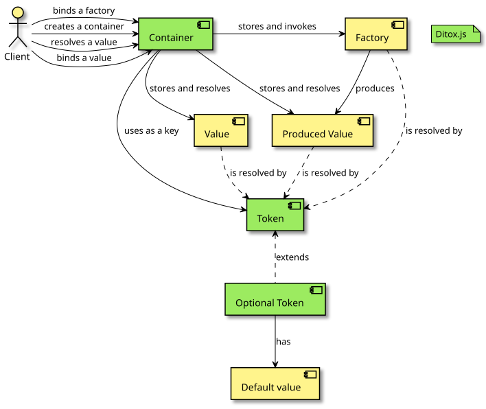

# ditox package


**Dependency injection for modular web applications**

Please see the documentation at [ditox.js.org](https://ditox.js.org)

[](https://www.npmjs.com/package/ditox)
[](https://github.com/mnasyrov/ditox/stargazers)
[](https://www.npmjs.com/package/ditox)
[](https://github.com/mnasyrov/ditox/blob/master/LICENSE)
[](https://coveralls.io/github/mnasyrov/ditox)

## Installation

You can use the following command to install this package:

```shell
npm install --save ditox
```

The package is distributed as ESM and CommonJS modules and requires Node.js 20
or newer.

Upgrading from v3? See the
[migration guide](https://github.com/mnasyrov/ditox/blob/master/MIGRATION.md).

## General description

DI pattern in general allows declaring and construct a code graph of an
application. It can be described by the following phases:

1. Code declaration phase:

- Defining public API and types of business layer
- Creation of injection tokens
- Declaring DI modules

2. Binding phase:

- Creation of a container
- Binding values, factories and modules to the container

3. Runtime phase:

- Running the code
- Values are constructed by registered factories

Diagram:



## Usage Example

```js
import { createContainer, injectable, optional, token } from 'ditox';

// This is app code, some factory functions and classes:
function createStorage(config) {
}

function createLogger(config) {
}

class UserService {
  constructor(storage, logger) {
  }
}

// Define tokens for injections.
const STORAGE_TOKEN = token('Token description for debugging');
const LOGGER_TOKEN = token();
const USER_SERVICE_TOKEN = token();

// Token can be optional with a default value.
const STORAGE_CONFIG_TOKEN = optional(token(), { name: 'default storage' });

// Create the container.
const container = createContainer();

// Provide a value to the container.
container.bindValue(STORAGE_CONFIG_TOKEN, { name: 'custom storage' });

// Dynamic values are provided by factories.

// A factory can be decorated with `injectable()` to resolve its arguments.
// By default, a factory has `singleton` lifetime.
container.bindFactory(
  STORAGE_TOKEN,
  injectable(createStorage, STORAGE_CONFIG_TOKEN),
);

// A factory can have `transient` lifetime to create a value on each resolving.
container.bindFactory(LOGGER_TOKEN, createLogger, { scope: 'transient' });

// A class can be injected by `injectableClass()` which calls its constructor
// with injected dependencies as arguments.
container.bindFactory(
  USER_SERVICE_TOKEN,
  injectable(
    (storage, logger) => new UserService(storage, logger),
    STORAGE_TOKEN,
    // A token can be made optional to resolve with a default value
    // when it is not found during resolving.
    optional(LOGGER_TOKEN),
  ),
  {
    // `scoped` and `singleton` scopes can have `onRemoved` callback.
    // It is called when a token is removed from the container.
    scope: 'scoped',
    onRemoved: (userService) => userService.destroy(),
  },
);

// Get a value from the container, it returns `undefined` in case a value is not found.
const logger = container.get(LOGGER_TOKEN);

// Resolve a value, it throws `ResolverError` in case a value is not found.
const userService = container.resolve(USER_SERVICE_TOKEN);

// Remove a value from the container.
container.remove(LOGGER_TOKEN);

// Clean up the container.
container.removeAll();
```

## Container Hierarchy

Ditox.js supports a "parent-child" hierarchy. If the child container cannot
resolve a token, it asks the parent container to resolve it:

```js
import { createContainer, token } from 'ditox';

const V1_TOKEN = token();
const V2_TOKEN = token();

const parent = createContainer();
parent.bindValue(V1_TOKEN, 10);
parent.bindValue(V2_TOKEN, 20);

const container = createContainer(parent);
container.bindValue(V2_TOKEN, 21);

container.resolve(V1_TOKEN); // 10
container.resolve(V2_TOKEN); // 21
```

### Multiple parent containers

A container can have multiple parent containers. Pass an array of parents when
creating a container. During resolution, parents are queried from left to right,
and the first parent that provides the token wins.

```js
import { createContainer, token } from 'ditox';

const VALUE = token();

// Create two parents
const p1 = createContainer();
const p2 = createContainer();

// Case 1: Only the second parent provides the token
p2.bindValue(VALUE, 'from-p2');
const child = createContainer([p1, p2]);
child.get(VALUE); // 'from-p2' (found in the second parent)

// Case 2: Both parents provide the token — order matters (left-to-right)
p1.bindValue(VALUE, 'from-p1');
const child2 = createContainer([p1, p2]);
child2.resolve(VALUE); // 'from-p1' (first parent wins)

// The child can still override parents
child2.bindValue(VALUE, 'from-child');
child2.resolve(VALUE); // 'from-child'
```

A parent does not have to be a full container. `createContainer()` accepts any
`ContainerResolver` — a read-only subset of `Container` with `hasToken()`,
`get()` and `resolve()` methods. It allows passing a parent which cannot be
mutated by the child container.

## Multi-value Tokens

`bindMultiValue()` appends a value to an array token. It allows registering
several implementations under a single token, for example a list of plugins or
event handlers, and resolving them together as an array:

```ts
import { bindMultiValue, createContainer, token } from 'ditox';

type Plugin = { name: string; setup: () => void };

const PLUGINS_TOKEN = token<ReadonlyArray<Plugin>>();

const container = createContainer();

// Register plugins independently, e.g. from different parts of the app.
bindMultiValue(container, PLUGINS_TOKEN, {
  name: 'analytics',
  setup: () => console.log('analytics is ready'),
});
bindMultiValue(container, PLUGINS_TOKEN, {
  name: 'logging',
  setup: () => console.log('logging is ready'),
});

// Resolve all registered plugins as a single array.
const plugins = container.resolve(PLUGINS_TOKEN);
plugins.forEach((plugin) => plugin.setup());
// analytics is ready
// logging is ready
```

## Shareable Tokens

By default, `token()` creates a unique symbol, so tokens created in different
bundles are different even if they have the same description. Pass the `key`
option to create a token which is backed by `Symbol.for(key)`. Such tokens are
shared via the global symbol registry, so different bundles or micro-frontends
with their own copies of the `ditox` package can bind and resolve the same
value:

```ts
import { token } from 'ditox';

// bundle-a.ts
const LOGGER_TOKEN = token<Logger>({ key: 'app.logger' });
container.bindValue(LOGGER_TOKEN, createLogger());

// bundle-b.ts – another bundle with its own copy of "ditox"
const LOGGER_TOKEN = token<Logger>({ key: 'app.logger' });
const logger = container.resolve(LOGGER_TOKEN); // Resolves the same binding
```

## Class Injection

`injectableClass()` decorates a class constructor to create a factory function.
The constructor is called with resolved dependencies as its arguments:

```ts
import { createContainer, injectableClass, token } from 'ditox';

class UserService {
  constructor(
    private storage: Storage,
    private logger: Logger,
  ) {}

  greet() {
    this.logger.log('Hello!');
  }
}

const USER_SERVICE_TOKEN = token<UserService>();

const container = createContainer();
container.bindFactory(
  USER_SERVICE_TOKEN,
  injectableClass(UserService, STORAGE_TOKEN, LOGGER_TOKEN),
);

const userService = container.resolve(USER_SERVICE_TOKEN);
userService.greet(); // Hello!
```

## Factory Lifetimes

Ditox.js supports managing the lifetime of values which factories produce. There
are the following types:

- `singleton` - **This is the default**. The value is created and cached by the
  most distant parent container which owns the factory function.
- `scoped` - The value is created and cached by the nearest container which owns
  the factory function.
- `transient` - The value is created every time it is resolved.

### `singleton`

**This is the default scope**. "Singleton" allows caching a produced value by a
most distant parent container which registered the factory function:

```js
import { createContainer, token } from 'ditox';

const TAG_TOKEN = token();
const LOGGER_TOKEN = token();

const createLogger = (tag) => (message) => console.log(`[${tag}] ${message}`);

const parent = createContainer();
parent.bindValue(TAG_TOKEN, 'parent');
parent.bindFactory(LOGGER_TOKEN, injectable(createLogger, TAG_TOKEN), {
  scope: 'singleton',
});

const container1 = createContainer(parent);
container1.bindValue(TAG_TOKEN, 'container1');

const container2 = createContainer(parent);
container2.bindValue(TAG_TOKEN, 'container2');

parent.resolve(LOGGER_TOKEN)('xyz'); // [parent] xyz
container1.resolve(LOGGER_TOKEN)('foo'); // [parent] foo
container2.resolve(LOGGER_TOKEN)('bar'); // [parent] bar
```

### `scoped`

"Scoped" lifetime allows having sub-containers with own instances of some
services which can be disposed. For example, a context during HTTP request
handling, or another unit of work:

```js
import { createContainer, token } from 'ditox';

const TAG_TOKEN = token();
const LOGGER_TOKEN = token();

const createLogger = (tag) => (message) => console.log(`[${tag}] ${message}`);

const parent = createContainer();
// `scoped` is default scope and can be omitted.
parent.bindFactory(LOGGER_TOKEN, injectable(createLogger, TAG_TOKEN), {
  scope: 'scoped',
});

const container1 = createContainer(parent);
container1.bindValue(TAG_TOKEN, 'container1');

const container2 = createContainer(parent);
container2.bindValue(TAG_TOKEN, 'container2');

parent.resolve(LOGGER_TOKEN)('xyz'); // throws ResolverError, the parent does not have TAG value.
container1.resolve(LOGGER_TOKEN)('foo'); // [container1] foo
container2.resolve(LOGGER_TOKEN)('bar'); // [container2] bar

// Dispose a container.
container1.removeAll();
```

### `transient`

"Transient" makes the factory produce a new value for each resolution:

```js
import { createContainer, token } from 'ditox';

const TAG_TOKEN = token();
const LOGGER_TOKEN = token();

const createLogger = (tag) => (message) => console.log(`[${tag}] ${message}`);

const parent = createContainer();
parent.bindValue(TAG_TOKEN, 'parent');
parent.bindFactory(LOGGER_TOKEN, injectable(createLogger, TAG_TOKEN), {
  scope: 'transient',
});

const container1 = createContainer(parent);
container1.bindValue(TAG_TOKEN, 'container1');

const container2 = createContainer(parent);
container2.bindValue(TAG_TOKEN, 'container2');

parent.resolve(LOGGER_TOKEN)('xyz'); // [parent] xyz
container1.resolve(LOGGER_TOKEN)('foo'); // [container1] foo
container2.resolve(LOGGER_TOKEN)('bar'); // [container2] bar

parent.bindValue(TAG_TOKEN, 'parent-rebind');
parent.resolve(LOGGER_TOKEN)('xyz'); // [parent-rebind] xyz
```

## Dependency Modules

Dependencies can be organized as modules in declarative way with
`ModuleDeclaration`. It is useful for providing pieces of functionality from
libraries to an app which depends on them.

The `strategy` field determines when the module's factory is executed:

- `lazy` (**default**): The factory is called only when the module or its
  exported tokens are first resolved.
- `eager`: The factory is called immediately after the module is bound to the
  container. This is useful for modules that need to initialize listeners or
  start background processes right away.

```typescript
import { Module, ModuleDeclaration, token } from 'ditox';
import { TRANSPORT_TOKEN } from './transport';

export type Logger = { log: (message: string) => void };
export const LOGGER_TOKEN = token<Logger>();

type LoggerModule = Module<{ logger: Logger }>;

const LOGGER_MODULE_TOKEN = token<LoggerModule>();

const LOGGER_MODULE: ModuleDeclaration<LoggerModule> = {
  // An optional explicit token for a module itself
  token: LOGGER_MODULE_TOKEN,

  // Use "eager" strategy to initialize the module immediately after binding
  strategy: 'eager',

  factory: (container) => {
    const transport = container.resolve(TRANSPORT_TOKEN).open();
    return {
      logger: { log: (message) => transport.write(message) },
      destroy: () => transport.close(),
    };
  },
  exports: {
    logger: LOGGER_TOKEN,
  },
};
```

Later such module declarations can be bound to a container:

```typescript
const container = createContainer();

// bind a single module
bindModule(container, LOGGER_MODULE);

// or bind multiple dependency modules
bindModules(container, [DATABASE_MODULE, CONFIG_MODULE, API_MODULE]);
```

Utility functions for module declarations:

- `declareModule()` – declare a module as `ModuleDeclaration` however `token`
  field can be optional for anonymous modules. Use the `imports` field to
  declare a module which binds other modules to a container.

Example for this function:

```typescript
const LOGGER_MODULE = declareModule<LoggerModule>({
  factory: createLoggerModule,
  exports: {
    logger: LOGGER_TOKEN,
  },
});

// An anonymous module which binds the imported modules to a container.
const APP_MODULE = declareModule({
  imports: [LOGGER_MODULE, DATABASE_MODULE],
  factory: () => ({}),
});
```

## API Reference

- Tokens

  - token<T>(options?: { key?: string; description?: string } | string):
    Token<T>
    - Creates a new binding token. Use `key` to create shareable tokens via
      `Symbol.for(key)`; otherwise a descriptive `Symbol(description)` is
      created
  - optional<T>(token: Token<T>, optionalValue?: T): OptionalToken<T |
    undefined>
    - Marks the token as optional and provides a default value for resolution
      when not bound
  - Types: Token<T>, RequiredToken<T>, OptionalToken<T>

- Container

  - createContainer(parent?: ContainerResolver |
    ReadonlyArray<ContainerResolver>): Container
    - Creates a new container optionally linked to one or more parents; parents
      are queried left-to-right
  - type ContainerResolver = Pick<Container, 'hasToken' | 'get' | 'resolve'>
    - A read-only subset of a container: `hasToken`, `get` and `resolve`. It
      allows passing a parent without exposing its mutation methods
  - class ResolverError extends Error
    - Thrown by `resolve()` when a token is not found and no optional default
      exists
  - type FactoryScope = 'scoped' | 'singleton' | 'transient'
  - type FactoryOptions<T>
    - For 'scoped' | 'singleton': { scope?: 'scoped' | 'singleton'; onRemoved?:
      (value: T) => void }
    - For 'transient': { scope: 'transient' }
  - type Container API
    - bindValue<T>(token: Token<T>, value: T): void — bind a concrete value
    - bindFactory<T>(token: Token<T>, factory: (container: Container) => T,
      options?: FactoryOptions<T>): void — bind a factory with lifetime options
    - hasToken(token: Token<unknown>): boolean — check token presence in
      hierarchy
    - get<T>(token: Token<T>): T | undefined — try resolve or return undefined;
      optional tokens return their default
    - resolve<T>(token: Token<T>): T — resolve or throw ResolverError; optional
      tokens return their default
    - remove<T>(token: Token<T>): void — remove binding; for scoped/singleton
      factories calls `onRemoved` if provided
    - removeAll(): void — remove all bindings and call `onRemoved` for
      applicable factories

- Utilities

  - isToken<T>(value: unknown): value is Token<T> — checks if a value looks like
    a token
  - bindMultiValue<T>(container: Container, token: Token<ReadonlyArray<T>>,
    value: T): void — appends a value to an array token
  - tryResolveValue(container: Container, tokenOrMap): value | object — resolves
    or returns undefined for missing tokens; supports an object map of tokens
  - tryResolveValues(container: Container, ...tokenOrMaps): array — batched
    variant of tryResolveValue
  - resolveValue(container: Container, tokenOrMap): value | object — resolves or
    throws on missing tokens; supports an object map of tokens
  - resolveValues(container: Container, ...tokenOrMaps): array — batched variant
    of resolveValue
  - injectable(factory, ...tokens): (container: Container) => Result — decorates
    a factory to receive resolved values as arguments
  - injectableClass(Class, ...tokens): (container: Container) => Instance —
    decorates a class constructor to receive resolved values

- Modules
  - Types
    - Module<Props = {}> — a module object: exported values plus optional
      destroy(): void
    - ModuleDeclaration<T extends Module> — declarative description of a module:
      - token: Token<T> — required token
      - imports?: ReadonlyArray<ModuleBindingEntry> — optional imports
      - factory: (container: Container) => T — factory function
      - exports?: Dictionary — optional exported tokens
      - beforeBinding?: (container: Container) => void — optional callback
      - afterBinding?: (container: Container) => void — optional callback
      - strategy?: 'eager' | 'lazy' — execution strategy (default: 'lazy')
    - BindModuleOptions — { scope?: 'scoped' | 'singleton' }
    - ModuleBindingEntry — ModuleDeclaration or { module, options }
  - bindModule(container: Container, module: ModuleDeclaration<T>, options?:
    BindModuleOptions): void
    - Binds a module; exported values are bound via factories; module factory
      respects scope; calls destroy() and removes exports on unbinding
  - bindModules(container: Container, modules:
    ReadonlyArray<ModuleBindingEntry>): void — binds multiple modules
  - declareModule(declaration): ModuleDeclaration<T>
    - Creates a module declaration; generates a token if not provided; use the
      `imports` field to bind other modules along with the declared one

---

This project is licensed under the
[MIT license](https://github.com/mnasyrov/ditox/blob/master/LICENSE).
